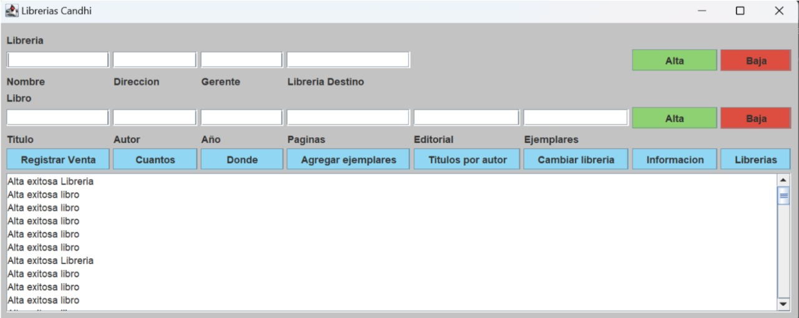

# Sistema de Gestión para Asociación de Librerías

**Autora:** Irene Escudero Cázarez  
**Fecha:** 15 de mayo de 2024  
**Curso:** Algoritmos y programas  
**Institución:** Instituto Tecnológico Autónomo de México

---

## Descripción General

Este proyecto consiste en un sistema informático desarrollado en Java con GUI (Swing) que permite gestionar una asociación de librerías. Permite registrar y consultar información de sucursales, libros, ventas y realizar operaciones de administración de inventario de forma eficiente y automatizada.

---

## Objetivos

- Automatizar el manejo de múltiples librerías y sus inventarios.
- Facilitar la localización y gestión de libros.
- Optimizar recursos humanos y materiales.
- Implementar una GUI amigable para el usuario.

---

## Requisitos y Restricciones

### Requisitos funcionales

- Java y Eclipse para su ejecución.
- Todas las clases deben estar en el mismo proyecto o correctamente enlazadas.
- Solo se permiten valores numéricos mayores a 0.
- Datos deben coincidir con los registrados para realizar operaciones exitosas.

### Restricciones

- Máximo de **15 librerías** en la asociación.
- Cada librería puede almacenar un máximo de **50 libros**.
- No se pueden repetir nombres de libros o librerías.

---

### Compilación

```bash
javac *.java
```

### Ejecución

```bash
java EjecutableAsoLibrerias
```

El sistema cargará automáticamente el archivo `DatosLibreria.txt` al inicio si se encuentra en el mismo directorio.

---

## Carga Inicial con `DatosLibreria.txt`

Este archivo contiene instrucciones para poblar el sistema. Debe estar en la misma carpeta del programa.

### Formato del archivo

LIBRERIA;Nombre;Dirección;Gerente
LIBRO;NombreLibreria;Título;Autor;Año;Páginas;Editorial;Cantidad

---

## Estructura del Proyecto

### Libro.java
Representa un libro con los siguientes atributos:

- **titulo**: Título del libro.
- **autor**: Autor del libro.
- **anio**: Año de publicación.
- **numPaginas**: Número de páginas.
- **editorial**: Editorial del libro.

### Métodos principales:

- Constructores y getters.
- equals(Libro otro): Compara libros por título y autor.
- compareTo(Libro otro): Compara libros por titulo.
- toString(): Representación textual del libro.

|           Libro           |
|---------------------------|
| - titulo: String          |
| - autor: String           |
| - anio: int               |
| - numPaginas: int         |
| - editorial: String       |
|---------------------------|
| + Libro(...)              |
| + getTitulo()             |
| + getAutor()              |
| + getAnio()               |
| + getNumPaginas()         |
| + getEditorial()          |
| + equals(Libro)           |
| + compareTo(Libro)        |
| + toString()              |
|---------------------------|

---

### Libreria.java
Representa una librería individual con:

- **nombre**: Nombre de la librería.
- **direccion**: Dirección física.
- **gerente**: Nombre del gerente.
- **libros**: Arreglo de libros disponibles.
- **ejemplares**: Cantidad de ejemplares por libro.

### Métodos principales:

- altaLibro(Libro libro, int cantidad): Agrega un libro al inventario.
- bajaLibro(String titulo): Elimina un libro del inventario.
- registrarVentaLib(String titulo, int cantidad): Registra la venta de ejemplares.
- cuantosHayTitulo(String titulo): Consulta la cantidad de ejemplares de un título.
- librosAutor(String autor): Lista libros de un autor específico.
- agregarEjemplares(String titulo, int cantidad): Agrega ejemplares a un libro existente.
- infoLibro(String titulo): Muestra información detallada de un libro.

|            Libreria              |
|----------------------------------|
| - nombre: String                 |
| - direccion: String              |
| - gerente: String                |
| - libros: Libro[]                |
| - ejemplares: Integer[]          |
| - MAX: int                       |
| - ocupados: int                  |
|----------------------------------|
| + Libreria(...)                  |
| + getNombre()                    |
| + getDireccion()                 |
| + getGerente()                   |
| + altaLibro(...)                 |
| + bajaLibro(...)                 |
| + registrarVentaLib(...)         |
| + cuantosHayTitulo(...)          |
| + librosAutor(...)               |
| + agregarEjemplares(...)         |
| + infoLibro(...)                 |
| + toString()                     |
|----------------------------------|

---

### AsoLib.java
Gestiona la asociación de librerías:

- **nombre**: Nombre de la asociación.
- **librerias**: Arreglo de librerías afiliadas.

### Métodos principales:

- altaLibreria(Libreria libreria): Agrega una nueva librería.
- bajaLibreria(String nombre): Elimina una librería existente.
- altaLibro(String nombreLibreria, Libro libro, int cantidad): Agrega un libro a una librería específica.
- bajaLibro(String nombreLibreria, String titulo): Elimina un libro de una librería.
- registrarVenta(String nombreLibreria, String titulo, int cantidad): Registra una venta en una librería.
- cuantosHayTituloTotal(String titulo): Consulta la cantidad total de ejemplares de un título en todas las librerías.
- donde(String titulo): Indica en qué librerías se encuentra un título.
- titulosPorAutor(String autor): Lista todos los títulos de un autor en la asociación.
- cambioDeLibreria(String titulo, String origen, String destino, int cantidad): Transfiere ejemplares de un libro entre librerías.
- agregarEjemplares(String nombreLibreria, String titulo, int cantidad): Agrega ejemplares a un libro en una librería.
- infoLibreria(String nombre): Muestra información detallada de una librería.
- infoLibro(String nombreLibreria, String titulo): Muestra información detallada de un libro en una librería.

|                 AsoLib                     |
|--------------------------------------------|
| - nombre: String                           |
| - librerias: Libreria[]                    |
| - MAX: int                                 |
| - ocupados: int                            |
|--------------------------------------------|
| + AsoLib(...)                              |
| + altaLibreria(...)                        |
| + bajaLibreria(...)                        |
| + altaLibro(...)                           |
| + bajaLibro(...)                           |
| + registrarVenta(...)                      |
| + cuantosHayTituloTotal(...)               |
| + donde(...)                               |
| + titulosPorAutor(...)                     |
| + cambioDeLibreria(...)                    |
| + agregarEjemplares(...)                   |
| + infoLibreria(...)                        |
| + infoLibro(...)                           |
| + librerias()                              |
| + toString()                               |
|--------------------------------------------|

---

### VistaAsoLib.java

Interfaz gráfica basada en Swing. Permite realizar todas las operaciones con botones y campos de texto. Muestra resultados y mensajes en un área de texto central.

---

### ControladorAsoLib.java

Clase intermediaria entre la interfaz gráfica (Vista) y la lógica del sistema (AsoLib). Se encarga de procesar los eventos, validar entradas y mostrar resultados al usuario.

---

### EjecutableAsoLibrerias.java

Clase principal que lanza la aplicación. Realiza la carga automática del archivo `DatosLibreria.txt` y crea la ventana gráfica principal.

---

### DatosLibreria.txt

Archivo de texto con instrucciones para poblar el sistema al inicio. Debe contener líneas como:

Este archivo debe estar en la misma carpeta donde se ejecuta el programa.
---

## Documentación Adicional
### GUI

Para una explicación más detallada del proyecto, incluyendo contexto, análisis, diseño, pruebas y conclusiones, consulta el documento completo en PDF:

[Ver ProyectoFinal.pdf](ProyectoFinal.pdf)

